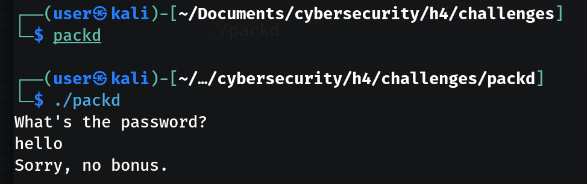

# H4 Some Disassembly Required

## X - Summary
- Idapro & Ghidra lets the user break down a programs executable into C code
- There are also lower level CLI tools such as ltrace & strace which give a glance of what the executable is doing, showing reading and writing operations
- Ghidra is an extensive tool, overall it's easy to pick up and debug code
- Although the code is in C, with the enhanced IDE the tool offers, its possible to follow, rename and ultimately understand what the code is actually doing and how it's being executed
## A - install Ghidra
https://github.com/NationalSecurityAgency/ghidra?tab=readme-ov-file#install

## B - Rever-C

Get binary
```
wget https://terokarvinen.com/loota/yctjx7/ezbin-challenges.zip  
```
Enter executable directory & run
```
./packd
```


Copy executable input string `What's the password`

Open and view executable in code editor - the input string can be seen and parts of the password as well. A link to the UPX executable packer is available.

Unpack the executable


Open unpacked executable in IDE


Password and flag found
```
What's the password?
piilos-AnAnAs
Yes! That's the password. FLAG{Tero-0e3bed0a89d8851da933c64fefad4ff2}
```

## C - If backwards

Get binary

```
wget https://terokarvinen.com/loota/yctjx7/ezbin-challenges.zip  
```

Enter executable directory & run

```
./passtr
```

Navigate to your local Ghidra directory & start
```
./ghidraRun
```
Create new project & click on green dragon then import binary

select and run analysis

The main function can be observed

Hack: Patch instruction in Ghidra by changing the conditional IF statement to return a false value when the correct password is inputted. By changing the assembly entry to from `JNZ`->  `JZ`

Save patched executable by going to File -> Export program


Test setup
```
# Apply executable permissions to file
sudo chmod +x passtr_patched
# run
./passtr_patched
```

Result
